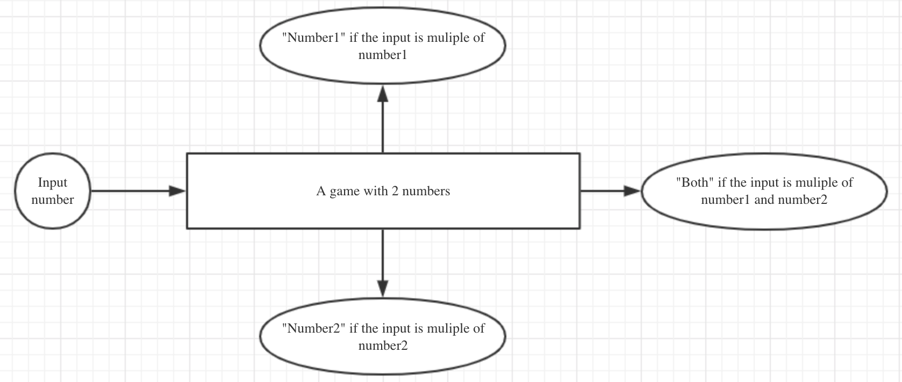
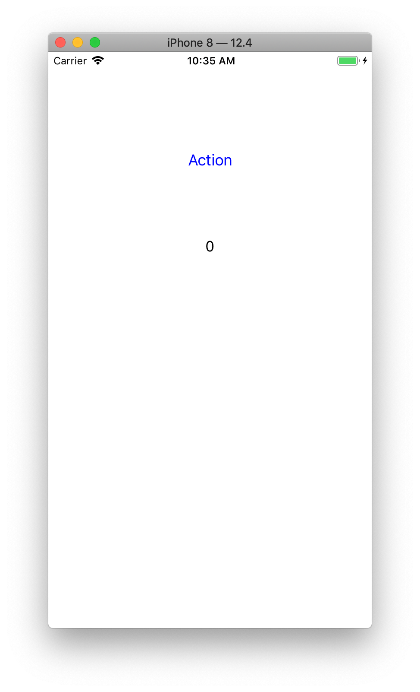

# Cucumberish demo for Objective-C

## 0 Init project

- run __pod install__ before open the project

## 1 Unit test

In this part, the sample is to test a game:



The feature file for testing is __example.feature__:

```
@run
Feature: A game for guessing 2 numbers

    Scenario: Test Input
        Given It's a game init with 2 and 3

        #case1
        When Input 8
        Then I should see Number1

        #case2
        When Input "9"
        Then I should see "Number2"

        #case3
        When Input "6"
        Then I should see "Both"
```

## 2 UI test

This part is a simple APP for increasing the counter:



The feature file for testing is __ui_example.feature__:

```
@run
Feature: Counter

    Scenario: Counter increase
        Given A clean demo app

        Then I should see value of label "lb_info" is "0"

        When Tap button "btn_action"
        Then I should see value of label "lb_info" is "1"
```
